# Agentic Workflow & Inference Optimization

## Course Goals
The primary objectives of this course are to:
- Understand the fundamentals of Agentic Workflow 
- Understand LLM Inference tradeoffs
- Learn how to implement inline Amazon Bedrock Agent


## Course Agenda

1. Agentic Workflow & LLM Inference Presentation
2. Amazon Bedrock Agent Presentation (Live Demo)
3. TP Build Your Agent
   - Step by Step Guide Here [instruction bellow](#Restaurant-Order-Agent)
4. TP Enhancement Presentation


### Amazon Bedrock RAG Workshop Setup - Group of 3 people -


**Scenario**: Scenario: You are a startup aiming to develop a SaaS platform that enables restaurants to deploy a chatbot. This chatbot will allow customers to place food orders conveniently from anywhere in a streamlined manner. To achieve this goal, you need to first build a Proof of Concept (PoC). The Agent will perfomr the following actions:

   - get_phone_number: Stores customer phone number
   - place_order: Adds new order to the system
   - get_all_orders: Retrieves all orders for a session
   - compute_bill: Calculates total bill from list of prices
   - send_notification_sms: Sends SMS notification about order

You have in mind a simple AWS architecure that does the job:

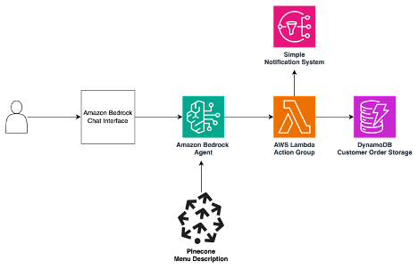

Here is an overview of the services in th architecture:

**AWS Lambda**
AWS Lambda is a serverless compute service that lets you run code without provisioning or managing servers. It automatically scales your application by running code in response to events, such as changes in data, system state, or user actions.  
<u>Key Features:</u>
- Supports multiple programming languages (Python, JavaScript, Java, etc.).
- Pay-as-you-go pricing based on compute time.
- Automatically scales based on workload.
- Integrated with other AWS services for event-driven architectures.

The AWS Lambda is the compute that serves the Agent executing the actions. It will receive an event from Amazon Bedrock Agent with defined parameters and a specific function to ecxecute. This function being the one listed on top.

**Amazon DynamoDB**
Amazon DynamoDB is a fully managed NoSQL database designed for fast and flexible performance at any scale. It is ideal for applications that require low-latency data access and high throughput.  
<u>Key Features:</u>
- Offers support for key-value and document data models.
- Built-in security, backup, and restore capabilities.
- Highly scalable, with no need to manage infrastructure.
- Provides global tables for multi-region, multi-active setups.

The DynamoDB here stores the sessionId of the conversation, the phone number of the user and the orders. Each conversation with the Agent is bounded to a sessionId.

**AWS Bedrock Agent**
AWS Bedrock Agent is part of the AWS Bedrock suite, enabling seamless integration of generative AI into applications without managing model infrastructure. The agent allows you to interact with foundation models for tasks like text generation, summarization, and Q&A.  
<u>Key Features:</u>
- Supports integration with various foundation models (e.g., Titan, third-party models).
- Integrates with other AWS services for secure and efficient deployment.
- Fully managed service to minimize operational complexity.

**Amazon Simple Notification Service (SNS)**
Amazon SNS is a fully managed messaging service for enabling communication between distributed systems, microservices, and serverless applications. It supports both push-based and pub/sub messaging patterns.  
<u>Key Features:</u>
- Supports various message delivery protocols (e.g., email, SMS, HTTP/S).
- Enables fan-out messaging with topic-based subscriptions.
- Integrated with AWS Lambda for event-driven architectures.
- Offers high availability and reliability.

The SNS topic will allow us to send a message to a pre-registered phone number (phone number must be approved in a non-prod environement, this is fine for this PoC)

**Pinecone**
Pinecone is a fully managed vector database designed for storing, indexing, and querying high-dimensional vector embeddings generated by machine learning models. It is often used in applications such as semantic search, recommendation systems, and anomaly detection.  
<u>Key Features:</u>
- Optimized for vector similarity search at scale.
- Supports real-time updates and high-throughput queries.
- Fully managed infrastructure, eliminating operational overhead.

The Pinecone VectorDB will allow us to store a description of our restaurant Menu to better serve the customer.

## Implement get_phone_number, place_order and get_all_orders Action

! Make sur you are on **us-east-1** when building the Agent

### Setup Bedrock Agent 

1. Let's create the Agent Ressource on AWS. Go fist on the Amazon Bedrock Service, select on the left tap **Agent** and click on **Create agent**


2. Give a name to your agent to make it recognizable from others that will be created by your collegues
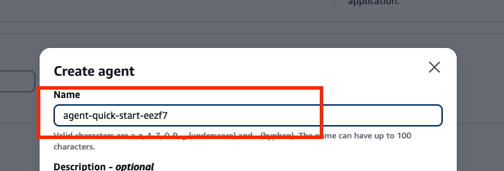

3. Choose Claude 3.5 Haiku as the model that the Agent will use to interpret the customer requests and the Action outcomes. Haiku offers a really good price/performance ratio

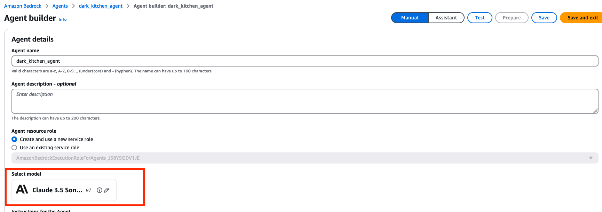


4. It is time to give Instructions to you Agent, here we will put our Agent goal, give a quick overview of the menu and some other instructions for the workflow the Agent should execute. Let's call the restorant we serve SOMA:

Instruction to enter:
```plaintext
You are an agent that gets orders for SOMA restaurant. 
Here is what the restaurant menu is with the prices:
Starters
1.	Soupe à l’Oignon Gratinée 8$
2.	Salade de Chèvre Chaud 6$
3.	Tartare de Saumon 9$
Main Dishes
1.	Bœuf Bourguignon 13$
2.	Coq au Vin 18$
3.	Filet de Bar à la Provençale 15$
4.	Ratatouille Végétarienne 11$
Desserts
1.	Crème Brûlée 6$
2.	Tarte Tatin 10$
3.	Profiteroles au Chocolat 8$
4.	Plateau de Fromages 13$

Always ask the user's phone number to be able to log it into your system.
For successive order please only consider the order being made, not the previous ones.
```


5. On **Additional Settings** make sure ot enable **User Input**


6. Below ont the **Action Group** tab click on **add**


7. Give a name to this Action Group, and make sure on the **Action Group Invocation** tab to click on "Quick Create a new Lambda function". An action will host all of our actions and theses actions will be handled by our AWS Lambda Function.

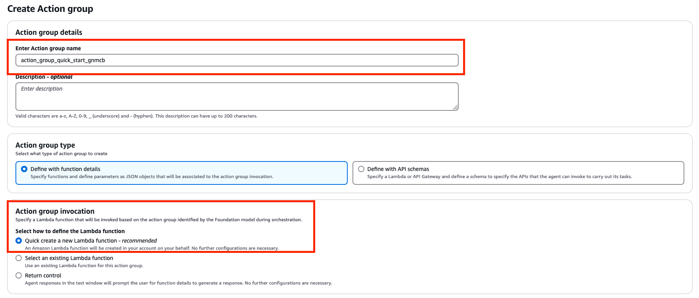


8. Lets start by creating our first two actions. Please use the same **name**, **Description** and **Parameters** specifications.

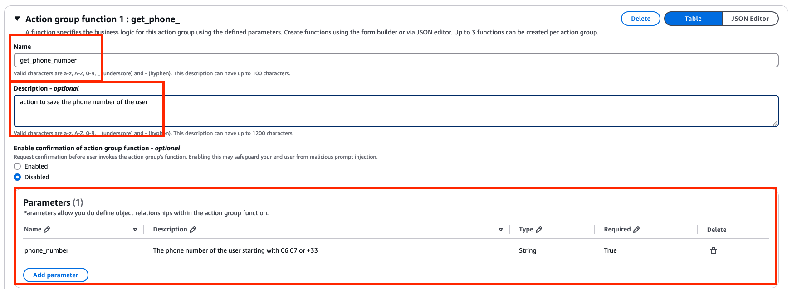


9. You can now click on **Create** to create your first Agent ! This can take some time.


10. You can now click on **Prepare**. This is an action you need to take to build the Agent (this is handled by AWS, it is just a way to publish a new version of the Agent)


### Setup DynamoDB

1. We will now setup our DynamoDB table. This is necessary as we want the different information from the customer (orders and phone number) to be stored and then processed by the SOMA restorant. Please go to DynamoDB Service.

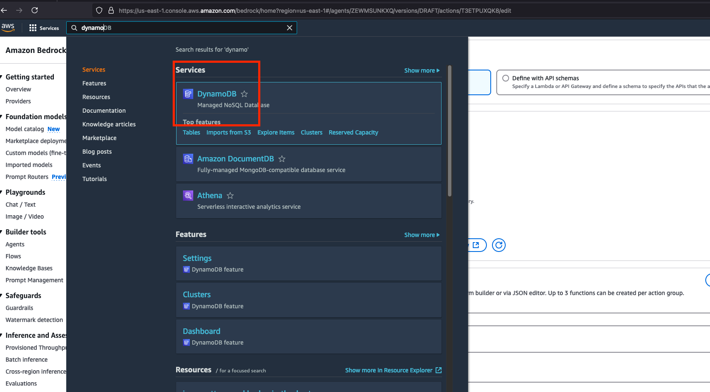

2. On the landing page, you can go on **Table** and create a NoSQL Table. Give it a **Name** and add as a **Partition Key** the **sessionId**. Every open conversation with the Agent generates a sessions Id. This is how we will partition our Table items and differentiate each of the restorant's customer.

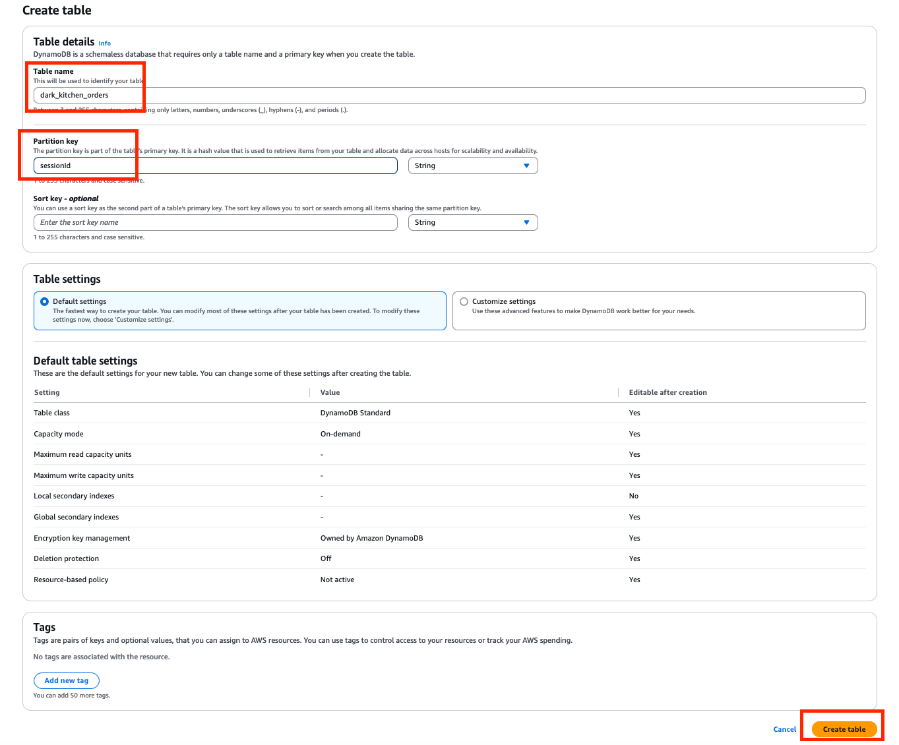


Now that the table is created, let's move to the AWS Lambda Function we have created when we built the Agent.

### Setup AWS Lambda

1. To find the Lambda function that have been created on your behalf, go back to your Agent, edit your Agent and go to the Action Group you have created. You will find a **View** button. It will lead you to the Lambda Function

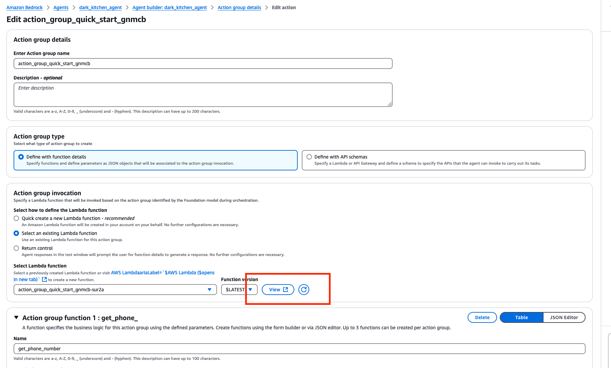

2. On the **Code** tab, copy this python code and past it to replace the default code.


```python
import json
import boto3
import logging
from botocore.exceptions import ClientError
import ast

# Setting up logging
logger = logging.getLogger()
logger.setLevel(logging.INFO)

# DynamoDB Resource initialization
dynamodb = boto3.resource('dynamodb')
table = dynamodb.Table("**********")  # Change to your table name

def format_response_body(event, responseBody):
    """
    Format the response body to include action group, function, and response data.
    """
    function_response = {
        'actionGroup': event['actionGroup'],
        'function': event['function'],
        'functionResponse': {
            'responseBody': responseBody
        }
    }
    
    session_attributes = event['sessionAttributes']
    prompt_session_attributes = event['promptSessionAttributes']
    
    action_response = {
        'messageVersion': '1.0', 
        'response': function_response,
        'sessionAttributes': session_attributes,
        'promptSessionAttributes': prompt_session_attributes
    }

    return action_response

def get_orders(sessionId):
    """
    Retrieve all orders associated with a sessionId from DynamoDB.
    """
    try:
        response = table.get_item(Key={"sessionId": sessionId})
        return response.get("Item", {}).get("orders", [])
    except Exception as e:
        logger.error(f"Error retrieving orders for sessionId {sessionId}: {e}")
        return []

def lambda_handler(event, context):
    """
    Main Lambda function handler that processes different actions based on the 'function' key.
    """
    logger.info(f"EVENT: {json.dumps(event)}")
    function = event['function']
    parameters = {param["name"]: param["value"] for param in event.get('parameters', [])}
    sessionId = event['sessionId']
    
    if function == 'get_phone_number':
        phone_number = parameters["phone_number"]
        item = {
            "sessionId": sessionId,
            "phone_number": phone_number 
        }
        try:
            # Only put the item if 'Id' does not already exist
            response = table.put_item(
                Item=item,
                ConditionExpression="attribute_not_exists(Id)"
            )
            logger.info("Phone number item created successfully!")
            logger.debug(f"PutItem Response: {response}")

            responseBody = {
                "TEXT": {
                    "body": f"The phone number {phone_number} has been saved for the conversation"
                }
            }
        except ClientError as e:
            if e.response['Error']['Code'] == 'ConditionalCheckFailedException':
                response = f"Phone number: {phone_number} already exists, no need to store it."
            else:
                response = f"An error occurred while storing the phone number {phone_number}: {e}"

            logger.error(f"Error storing phone number {phone_number}: {response}")

            responseBody = {
                "TEXT": {
                    "body": response
                }
            }

        logger.info(f"ResponseBody: {json.dumps(responseBody)}")
        action_response = format_response_body(event, responseBody)
        return action_response

    if function == 'place_order':
        order = get_orders(sessionId)
        order.append(parameters)

        try:
            response = table.update_item(
                Key={"sessionId": sessionId},
                UpdateExpression="SET orders = :orders",
                ExpressionAttributeValues={":orders": order}
            )
            logger.info("Order placed successfully!")
            logger.debug(f"UpdateItem Response: {response}")

            responseBody = {
                "TEXT": {
                    "body": "The order was placed successfully!"
                }
            }
        except Exception as e:
            logger.error(f"Error placing order for sessionId {sessionId}: {e}")
            responseBody = {
                "TEXT": {
                    "body": "Failed to place the order due to an error."
                }
            }

        logger.info(f"ResponseBody: {json.dumps(responseBody)}")
        action_response = format_response_body(event, responseBody)
        return action_response

    if function == 'get_all_orders':
        orders = get_orders(sessionId)
        responseBody = {
            "TEXT": {
                "body": f"The final list of orders is {orders}!"
            }
        }

        logger.info(f"ResponseBody: {json.dumps(responseBody)}")
        action_response = format_response_body(event, responseBody)
        return action_response
```

Make sure to input the Name of the table you just created here:

```python
table = dynamodb.Table("*******")  # Change to your table name
```

Click on **Deploy** to update the code the Lambda.

3. To make sure our lambda don't timeout, go on the **Configuration** tab, go to **General configuration** and click on **Edit**. Once there, se the **Timeout** to 30s or more.

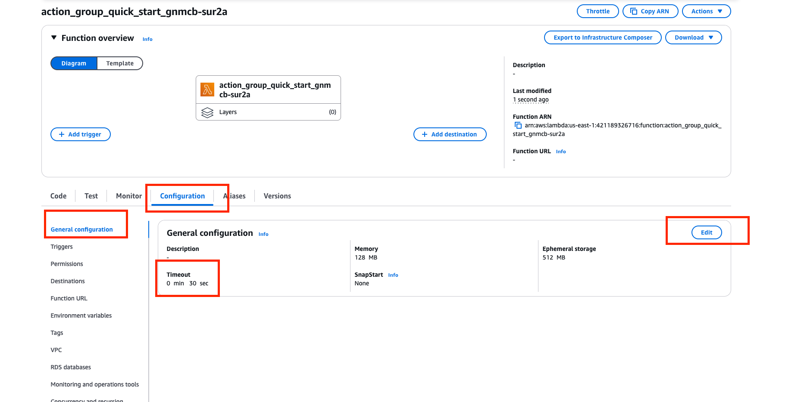

4. At this point you are almost set. Please **ask my intervention** to give your Lambda the rights to interact with DynamoDB.


### Test the agent !

Now if you go back on the Amazon Bedrock Agent you can now interact in Q&A fashion with it with the built in Chat Interface.

It is important that you test different scenarios and understand how the Agent behaves. Building Agents is a lot about prompt engineering and action design.


## Implement compute_bill and send_notification_sms Action

In this part of the PoC we will create the necessary backend and functions/action for our Agent to be able to notify our customers once an order have been validated and paid after computing the bill.

### Setup Simple Notification Service (SNS)

1. Go to the Simple Notification Service landing page

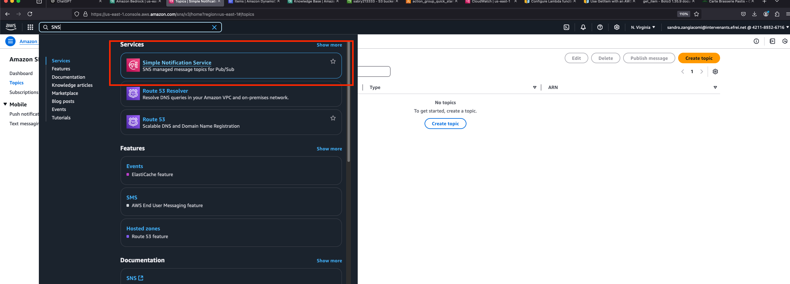

2. Crearte a Topic by clicking on **Create Topic**. This topic is basically a pub/sub canal that will be used to send SMS


3. Make sure to give it a proper **Name** and click on type **Standard**. You can then click on **Create Topic**

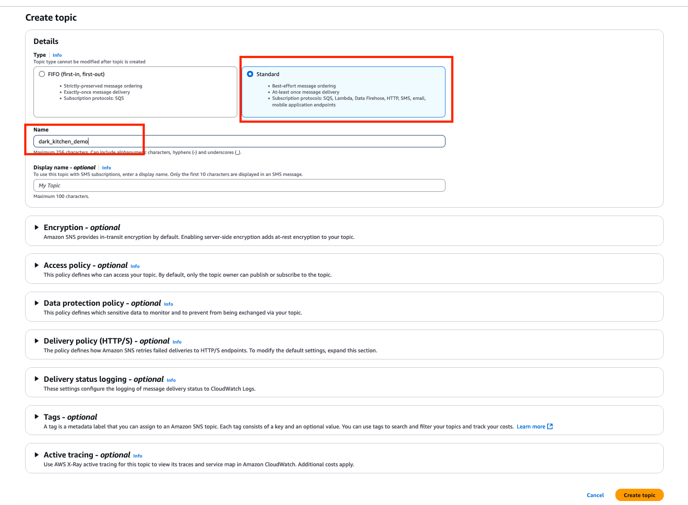

4. Once your Topic is created, go on it and click on **Create a subscription**. Here we will link a phone number to receive the messages sent by the topic. In prod (not PoC) this should be done whenever a new customer enters the chat. Here we will use a "Sandbox" environment of SNS. This means that only pre-approved phone number can receive notification.

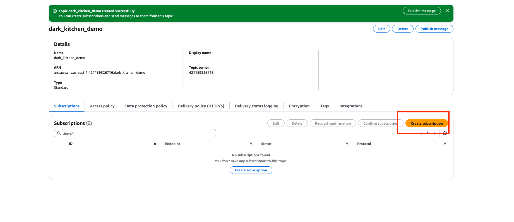

5. Follow the process to subscribe a phone number to the Topic you just created.


6. Now go back to your Agent and add the following Actions **compute_bill** and **send_notification_sms** to the Action Group you created in the first section. Make sure to use the same **Name**, **Parameter** and **Description**.

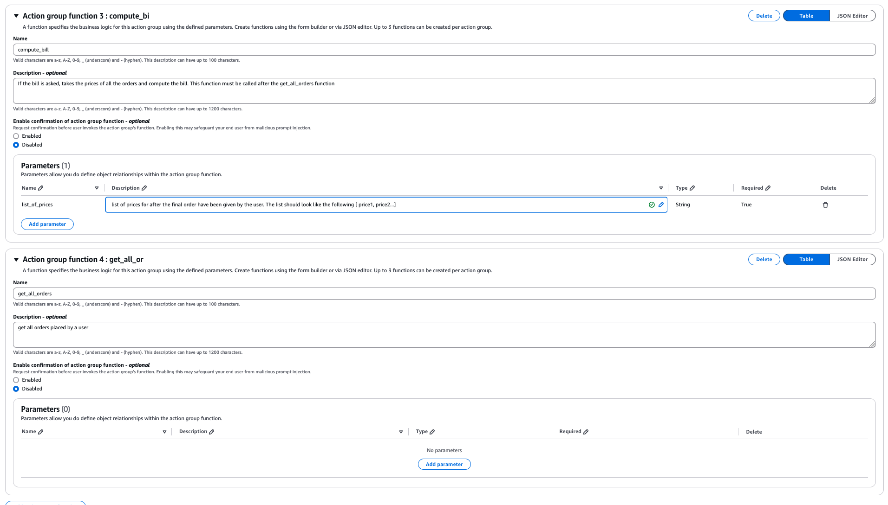


6. Ok great, now our Agent knows it can use compute_bill and send_notification_sms Action we have to make it available to our AWS Lambda function. Go to the AWS Lambda Function that performs the actions and add at the bottom of **def lambda_handler(event, context)** the following code:

```python
    if function == 'compute_bill':
        list_of_prices = parameters["list_of_prices"]
        # Convert the string to a list
        numbers = ast.literal_eval(list_of_prices)
        total = sum(numbers)

        responseBody = {
            "TEXT": {
                "body": f"The bill is {total}!"
            }
        }

        logger.info(f"Computed total bill: {total}")
        action_response = format_response_body(event, responseBody)
        return action_response

    if function == 'send_notification_sms':
        sns_client = boto3.client('sns')
        topic_arn = 'arn:aws:sns:us-east-1:********:******'  # Change to your SNS Topic ARN

        # The message you want to send
        message = """Thank you for your order with SOMA! 
        We're preparing your meal and will notify you when it's ready. 
        Enjoy your meal!"""

        try:
            # Send the message to the SNS topic
            response = sns_client.publish(
                TopicArn=topic_arn,
                Message=message,
                Subject='SOMA Order'
            )
            logger.info(f"SMS sent successfully! Response: {response}")

            responseBody = {
                "TEXT": {
                    "body": "SMS sent!"
                }
            }
        except ClientError as e:
            logger.error(f"Error sending SMS: {e}")
            responseBody = {
                "TEXT": {
                    "body": f"Failed to send SMS: {e}"
                }
            }

        logger.info(f"ResponseBody: {json.dumps(responseBody)}")
        action_response = format_response_body(event, responseBody)
        return action_response
```
Don't forget to update the **topic_arn** with the one you created

```python
topic_arn = 'arn:aws:sns:us-east-1:********:******'
```

7. Add the following instructions to your Agent:

```plaintext
Once the user is good with his/her orders, ask if the user want to fanalize the order and pay the bill. 
Once this is done you can send a notification sms 
```

## Add a Knowledge Base to your Agent. 

Adding a knowledge base can be seen as a new action that allows the Agent to find more context on the restorant you serve.

1. Go to your Agent, and click on **Edit in Agent Builder**


2. Once there, scroll down and click on **Add Knowledge Base**

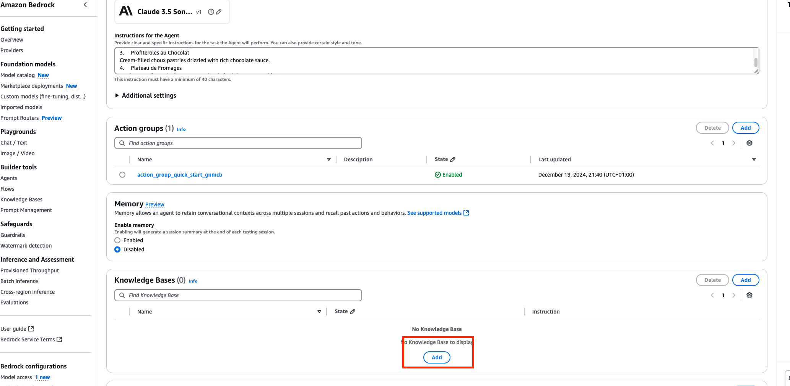

3. You can then select an existing knowledge base (take one knowledge base that you have created before this week). Also add the following **Knowledge Base Instruction for Agent**:
```bash
Knowledge Base for the description of the dishes of the menu
```


4. If you remember well, this Knowledge Base is linked to an S3 Bucket. This S3 Bucket contains the Amazon 2022 Shareholder Letter (considered as an object on S3). Please, go to the S3 Bucket, delete this object and upload to your bucket a pdf describing the restorant dishes. I gave you one here:

[Menu Description](./menu_desc.pdf)

Make sure you **Sync** the knowledge base with this new knowledge (document uploaded). Amazon Bederock will handle the chunking, the embedding and storage.

### Test the agent !

Once all these steps complete you can finally save the editing of your Agent, make sure it is **Prepared** and start playing with it. Act like a SOMA restorant's customer and order some food !

## TP Enhancement 

To finalize the PoC, I would like you to implement additional actions for the Agent. For instance, the Agent can register Delivery Adress, Order Status ect. Be creative !

For those who want to build a frontend for the Agent here is the AWS SDK to interact with the Agent you just created: [Bedrock Agent](https://boto3.amazonaws.com/v1/documentation/api/1.35.6/reference/services/bedrock-agent-runtime.html)

As demonstrated in the Vanilla Project Folder, you can build quickly a streamlit frontend. Let me know if you have any questions !
